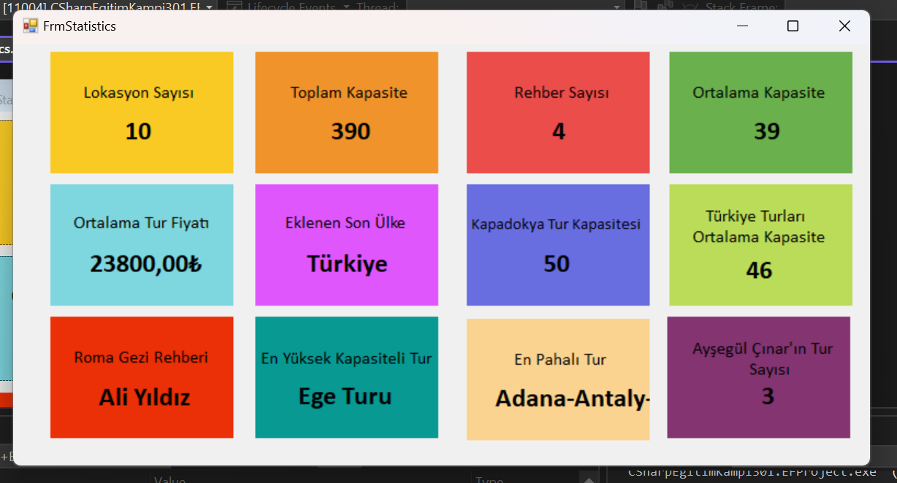

Bu proje, YouTube'da Murat Yücedağ'ın C# Eğitim Kampı'ndan OOP Modülünü içermektedir   

# CSharpEgitimKampi301.EFProject  

EgitimKampiEfTravelDb Projesi  

Bu proje, bir seyahat yönetim sistemi için hazırlanan bir Windows Forms uygulamasıdır. Veritabanı işlemlerini gerçekleştirmek için **Entity Framework** kullanılmıştır. Uygulama, rehber ve lokasyon bilgilerini yönetmek için çeşitli CRUD işlemleri ve istatistiksel raporlar sunmaktadır.  

📌 **Form1.cs** (Rehber Yönetimi)
- **Listeleme:** Veritabanındaki rehberleri listeler.
- **Ekleme:** Yeni rehber bilgisi ekler.
- **Silme:** Belirtilen rehberi siler.
- **Güncelleme:** Rehber bilgilerini günceller.
- **ID'ye Göre Getirme:** Belirtilen ID'ye sahip rehber bilgisini getirir.

📌 **FrmLocation.cs** (Lokasyon Yönetimi)
- **Listeleme:** Veritabanındaki lokasyonları listeler.
- **Ekleme:** Yeni lokasyon bilgisi ekler (kapasite, şehir, ülke, fiyat, rehber bilgisi).
- **Silme:** Belirtilen lokasyonu siler.
- **Güncelleme:** Lokasyon bilgilerini günceller.
- **Rehber Bilgisi ile ComboBox Desteği:** Rehber isim ve soyisimlerini birleştirerek ComboBox'ta gösterir.

📌### **FrmStatistics.cs** (İstatistikler)
- Toplam lokasyon sayısı
- Toplam kapasite
- Toplam rehber sayısı
- Ortalama kapasite
- Ortalama lokasyon fiyatı
- En son eklenen ülkenin adı
- "Kapadokya" şehir kapasitesi
- "Türkiye" ortalama kapasitesi
- "Roma Turistik" şehrinin rehberi
- En yüksek kapasiteli lokasyon
- En pahalı lokasyon
- "Ayşegül Çınar" rehberine bağlı lokasyon sayısı

## Kullanılan Teknolojiler
- **C#** (Windows Forms)
- **Entity Framework** (Database işlemleri için)
- **SQL Server** (Veritabanı)

## Ekran Görüntüsü
**FrmStatistics** ekranının çıktısı aşağıda yer almaktadır:

